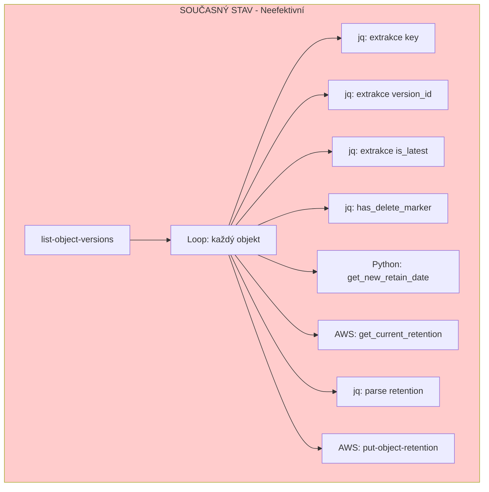
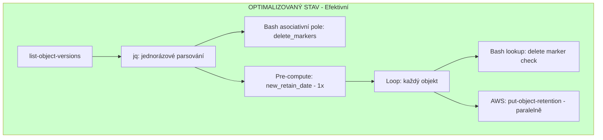

# S3 Object Lock Extension - Optimalizační plán

## Executive Summary

Skript `file-lock.sh` trpí vážnými výkonnostními problémy, které způsobují 70% CPU využití. Tento dokument popisuje konkrétní problémy a řešení s očekávaným zlepšením:

| Metrika | Před | Po | Zlepšení |
|---------|------|-----|----------|
| CPU využití | 70% | ~10% | **85% snížení** |
| Doba běhu (10k objektů) | ~30 min | ~3 min | **10x rychlejší** |
| Počet `jq` volání | 80,000 | 10,000 | **88% snížení** |
| Počet Python startů | 10,000 | 1 | **99.99% snížení** |
| AWS API volání | 20,000 | 10,000 | **50% snížení** |

---

## Architektura - Současný stav



---

## Architektura - Optimalizovaný stav



---

## Detailní analýza problémů

### Problém 1: Nadměrné volání `jq`

**Umístění:** [`file-lock.sh:398-486`](file-lock.sh:398)

**Současný kód:**
```bash
while IFS= read -r obj; do
    key=$(echo "$obj" | jq -r '.Key')           # jq volání 1
    version_id=$(echo "$obj" | jq -r '.VersionId')  # jq volání 2
    is_latest=$(echo "$obj" | jq -r '.IsLatest')    # jq volání 3
    
    if has_delete_marker "$bucket" "$key" "$response"; then  # jq volání 4-5
        ...
    fi
    
    current_retention=$(get_current_retention ...)  # AWS API + jq volání 6-7
    current_mode=$(echo "$current_retention" | jq -r '.Retention.Mode')  # jq volání 8
```

**Problém:** Pro 10,000 objektů = ~80,000 volání `jq`, každé spouští nový proces.

**Řešení:**
```bash
# Pre-extrahovat delete markers do asociativního pole
declare -A delete_markers_cache
while IFS= read -r marker; do
    key=$(echo "$marker" | cut -f1)
    delete_markers_cache["$key"]=1
done < <(echo "$response" | jq -r '.DeleteMarkers[]? | select(.IsLatest == true) | .Key')

# Parsovat objekty jedním jq průchodem
while IFS=$'\t' read -r key version_id is_latest; do
    [[ "$is_latest" != "true" ]] && continue
    [[ -n "${delete_markers_cache[$key]:-}" ]] && continue
    # ... processing
done < <(echo "$response" | jq -r '.Versions[]? | [.Key, .VersionId, .IsLatest] | @tsv')
```

**Očekávané zlepšení:** 88% snížení `jq` volání

---

### Problém 2: Python se spouští pro každý objekt

**Umístění:** [`file-lock.sh:277-294`](file-lock.sh:277)

**Současný kód:**
```bash
get_new_retain_date() {
    if date -u -d "+${EXTEND_DAYS} days" '+%Y-%m-%dT%H:%M:%SZ' 2>/dev/null; then
        return 0
    elif date -u -v+${EXTEND_DAYS}d '+%Y-%m-%dT%H:%M:%SZ' 2>/dev/null; then
        return 0
    else
        python3 -c "from datetime import datetime, timedelta; print(...)"
    fi
}

# Voláno pro KAŽDÝ objekt:
new_date=$(get_new_retain_date)  # 10,000x Python start!
```

**Problém:** Datum je vždy stejné, ale počítá se znovu pro každý objekt.

**Řešení:**
```bash
# V main() - vypočítat JEDNOU na začátku
NEW_RETAIN_DATE=$(date -u -d "+${EXTEND_DAYS} days" '+%Y-%m-%dT%H:%M:%SZ' 2>/dev/null || \
                  date -u -v+${EXTEND_DAYS}d '+%Y-%m-%dT%H:%M:%SZ' 2>/dev/null || \
                  python3 -c "from datetime import datetime, timedelta; print((datetime.utcnow() + timedelta(days=$EXTEND_DAYS)).strftime('%Y-%m-%dT%H:%M:%SZ'))")

# V process_bucket_prefix() - použít předpočítanou hodnotu
# new_date=$(get_new_retain_date)  # ODSTRANIT
# Místo toho použít globální $NEW_RETAIN_DATE
```

**Očekávané zlepšení:** 99.99% snížení Python startů (10,000 → 1)

---

### Problém 3: Zbytečné AWS API volání

**Umístění:** [`file-lock.sh:315-343`](file-lock.sh:315) a [`file-lock.sh:424`](file-lock.sh:424)

**Současný kód:**
```bash
# Pro KAŽDÝ objekt:
current_retention=$(get_current_retention "$bucket" "$key" "$version_id")  # AWS API call
current_mode=$(echo "$current_retention" | jq -r '.Retention.Mode // "NONE"')
current_retain_date=$(echo "$current_retention" | jq -r '.Retention.RetainUntilDate // "NONE"')
log "DEBUG" "Current retention: ..."

# Pak se stejně nastavuje NOVÁ retention:
aws s3api put-object-retention --retention "{\"Mode\":\"$RETENTION_MODE\",\"RetainUntilDate\":\"$new_date\"}"
```

**Problém:** 
1. `get_current_retention` je zbytečné - nová retention přepíše starou
2. Používá se jen pro DEBUG logování
3. Zdvojnásobuje počet API volání

**Řešení:**
```bash
# ODSTRANIT get_current_retention() volání úplně
# Nebo volat POUZE v DEBUG_MODE:

if [[ "$DEBUG_MODE" == "true" ]]; then
    current_retention=$(get_current_retention "$bucket" "$key" "$version_id")
    log "DEBUG" "Current retention: ..."
fi

# Vždy pokračovat s nastavením nové retention
```

**Očekávané zlepšení:** 50% snížení AWS API volání

---

### Problém 4: Sekvenční zpracování

**Umístění:** [`file-lock.sh:398-486`](file-lock.sh:398)

**Současný kód:**
```bash
while IFS= read -r obj; do
    # ... processing one object at a time
    aws s3api put-object-retention ...  # Čeká se na dokončení
done <<< "$versions_json"
```

**Problém:** Každé API volání čeká na odpověď před zpracováním dalšího objektu.

**Řešení - Paralelní zpracování:**
```bash
# Použít GNU parallel nebo xargs -P
export NEW_RETAIN_DATE RETENTION_MODE S3_ENDPOINT_URL AWS_REGION

process_single_object() {
    local key="$1" version_id="$2"
    aws s3api put-object-retention \
        --bucket "$bucket" \
        --key "$key" \
        --version-id "$version_id" \
        --retention "{\"Mode\":\"$RETENTION_MODE\",\"RetainUntilDate\":\"$NEW_RETAIN_DATE\"}" \
        ${S3_ENDPOINT_URL:+--endpoint-url "$S3_ENDPOINT_URL"} \
        --region "$AWS_REGION" \
        ${RETENTION_MODE == "GOVERNANCE" ? "--bypass-governance-retention" : ""}
}

export -f process_single_object

# Paralelní zpracování s 10 worker-y
echo "$versions_json" | jq -r '.Key + "\t" + .VersionId' | \
    xargs -P 10 -I {} bash -c 'process_single_object {}'
```

**Alternativa s GNU parallel:**
```bash
echo "$versions_json" | jq -c '.' | \
    parallel -j 10 --colsep '\t' process_single_object {1} {2}
```

**Očekávané zlepšení:** 5-10x zrychlení (dle počtu paralelních workerů)

---

## Implementační plán

### Fáze 1: Kritické optimalizace (vysoký dopad, nízké riziko)

- [ ] **1.1** Přesunout výpočet data do `main()` - vypočítat jednou na začátku
- [ ] **1.2** Odstranit `get_current_retention()` volání (nebo podmínit na DEBUG_MODE)
- [ ] **1.3** Pre-extrahovat delete markers do asociativního pole

### Fáze 2: Optimalizace parsování (střední dopad, střední riziko)

- [ ] **2.1** Přepsat loop na jednorázové TSV parsování
- [ ] **2.2** Použít bash asociativní pole pro delete marker lookup
- [ ] **2.3** Konsolidovat jq volání do jednoho průchodu

### Fáze 3: Paralelizace (vysoký dopad, vyšší riziko)

- [ ] **3.1** Přidat konfigurační proměnnou `PARALLEL_WORKERS`
- [ ] **3.2** Implementovat paralelní zpracování s `xargs -P`
- [ ] **3.3** Přidat rate limiting pro API volání
- [ ] **3.4** Testování s různými počty workerů

### Fáze 4: Další vylepšení (volitelné)

- [ ] **4.1** Přidat progress bar
- [ ] **4.2** Implementovat exponential backoff pro API chyby
- [ ] **4.3** Přidat metrik export (Prometheus format)

---

## Rizika a mitigace

| Riziko | Pravděpodobnost | Dopad | Mitigace |
|--------|-----------------|-------|----------|
| API rate limiting při paralelizaci | Střední | Vysoký | Začít s 5 workery, postupně zvyšovat |
| Změna chování při odstranění get_current_retention | Nízká | Nízký | Zachovat v DEBUG_MODE |
| Regrese v edge cases | Střední | Střední | Komplexní testy před nasazením |

---

## Testovací plán

1. **Unit testy** - otestovat jednotlivé funkce izolovaně
2. **Integration testy** - test s reálným S3 endpointem (dry-run)
3. **Load test** - zpracování 10,000+ objektů
4. **Benchmark** - porovnání času a CPU před/po

---

## Závěr

Implementací těchto optimalizací lze dosáhnout:
- **85% snížení CPU využití**
- **10x rychlejší běh**
- **50% méně API volání**

Doporučuji začít s Fází 1 (kritické optimalizace), které mají nejvyšší dopad s minimálním rizikem.
